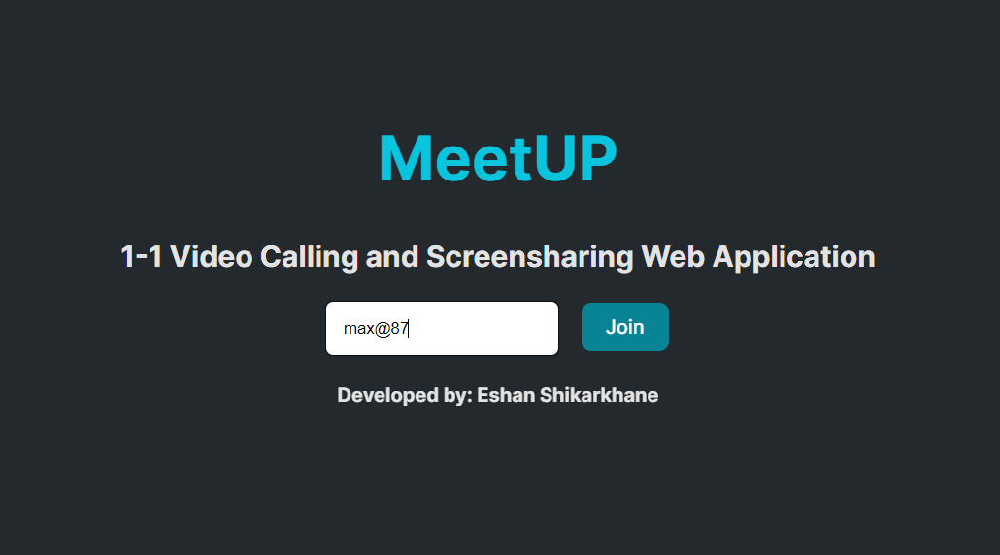
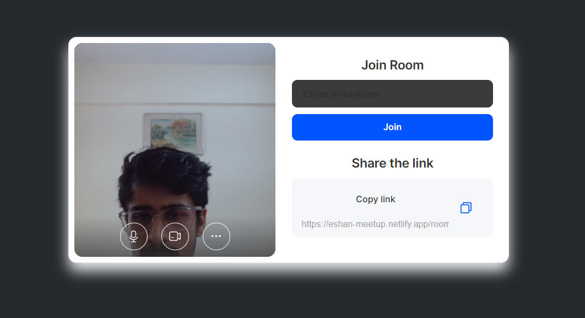
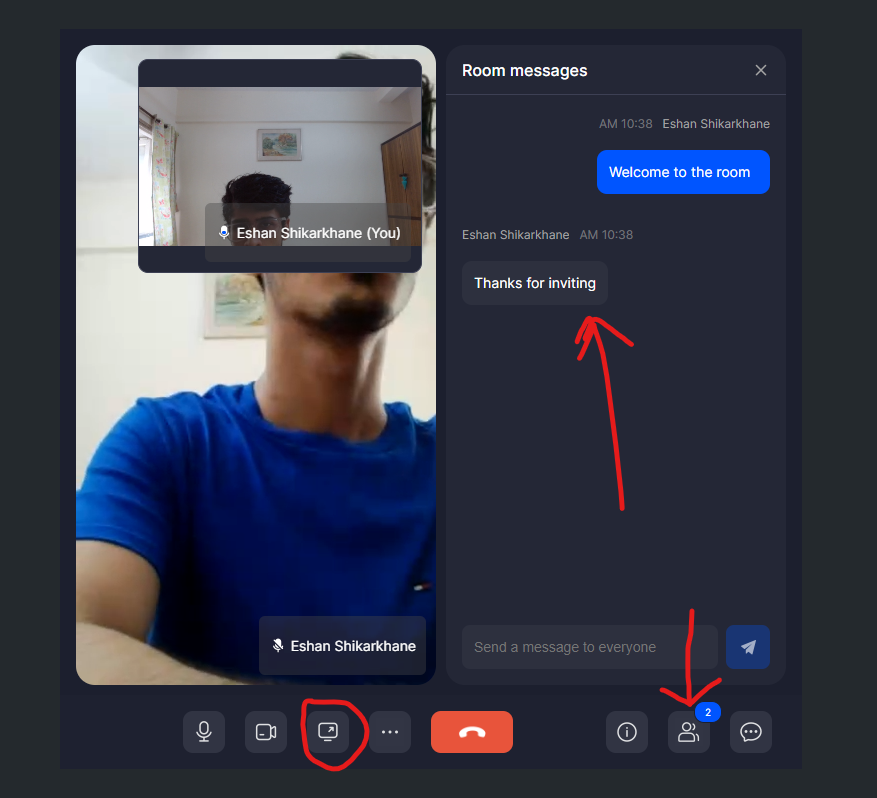

# MeetUp

## Description

 A cutting-edge 1 on 1 video call and screen sharing web application that empowers seamless communication in real-time. This application is meticulously crafted using React, React Router, and leverages the power of ZegoCloud's WebRTC API Platform to deliver an immersive and interactive user experience.

## Project URL

You can access the live version of the project at [Project URL](https://eshan-meetup.netlify.app/)

## Screenshots

### 1. Enter the room ID (either provided by your meet partner or a brand new one by yourself )

### 2. Enable Camera and Microphone Permissions, Copy the link and share it if needed.

### 3. Share your Screen, chat with your partner and have a 1-1 conversation on Meetup!

## Technologies Used

## Features

- 1 on 1 video calls
- Screen sharing
- Share meet link
- in meet chat 
- view number of participants  

## License
This project is licensed under the MIT License - see the [LICENSE](LICENSE) file for details.
